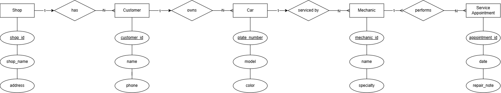

# INFOMAN1 – Week 2 Lab: Conceptual ERD Case Study
**Name:** Jade Roland Eduard C. Pinon
**Student ID:** 2511036
**Section:** BSIT - II

## Task 1 — Candidate Entities

| Entity | Justification |
|---|---|
| Shop | The scenario opens with "A small car repair shop wants to computerize its service records," making the shop the central organization the system is built around. |
| Customer | A Customer is a distinct participant that owns cars and initiates repairs |
| Car | Cars can have a model, a plate number and a color to have as its properties |
| Mechanic | The mechanic can have properties such as name, specialty and service appointment. |
| Service Appointment | Service appointments can take date and repair note as its attributes |

## Task 2 — Attributes per Entity

### Customer
- Primary Key: customer_id
- Attributes:
  - customer_id — Domain: numeric, auto-generated
  - name — Domain: text
  - phone — Domain: text

### Shop
- Primary Key: shop_id
- Attributes:
  - shop_id — Domain: numeric, auto-generated
  - shop_name — Domain: text
  - address — Domain: text

### Car
- Primary Key: plate_number
- Attributes:
  - plate_number — Domain: text
  - model — Domain: text
  - color — Domain: text

### Mechanic
- Primary Key: mechanic_id
- Attributes:
  - mechanic_id — Domain: numeric, auto-generated
  - name — Domain: text
  - specialty — Domain: text

### Service Appointment
- Primary Key: appointment_id
- Attributes:
  - appointment_id — Domain: numeric, auto-generated
  - date — Domain: date
  - repair_note — Domain: text 

## Task 3 — Relationships

| Relationship (verb phrase) | Between | Cardinality | Checked both directions? |
|---|---|---|---|

| services | Mechanic ↔ Car | M:N | The case explicitly supports it,  "one mechanic may work on many different cars over time — just as one car may be serviced by different mechanics on different visits." Both directions are many, so it's M:N (realized through the Service Appointment entity).

| belongs to | Car ↔ Customer | 1:N | A customer can bring in one or more cars for repairs, but those cars belong only to that specific customer |

| employs | Shop ↔ Mechanics | 1:N | The shop employs several mechanics |

| performs | Mechanic ↔ Service Appointment | 1:N | One mechanic can have many appointments |

| is for | Car ↔ Service Appointment | 1:N | each appointment services one car, a car has many appointments over time |

| has | Shop ↔ Customers | 1:N | "It says from the case study, the shop has many customers" |

## Task 4 — Conceptual ERD

The shop employs mechanics with a one to many relationship