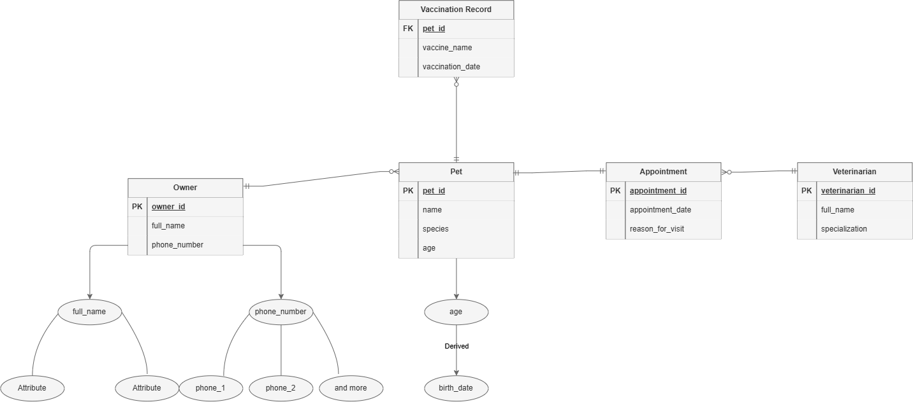

# INFOMAN1 — Week 3 Lab Answers

## Task 1 — Classify Attributes and Identify Weak Entities

Owner Full Name - Composite
Owner Phone Number - Multivalued
Pet age - Derived

Vaccination record should be a weak entity. It depends on a Pet to exist, the record has no meaning without the pet that recieved it. It cannot be uniquely identified because vaccine_name and vaccination_date can be shared by many pets. It also uses a partial key, its own attributes and the pet ID.

## Task 2 — Specify Participation Constraints

Owner - Pet: Owner || ----------- 0< Pet
Pet - Appointment: Pet || ---------- || Appointment
Veterinarian - Appointment: Veterinarian || ------------ 0< Appointment
Pet - Vaccination: Pet || ----------0< Vaccination

## Task 3 — Build the Logical ERD

## Task 4 — Translate to Relational Schema Notation

Owner(`owner_id`, full_name, phone_number)
Pet(`pet_id`, name, species, age)
Appointment(`appointment_id`, appointment_date, reason_for_visit)
Veterinarian(`veterinarian_id`, full_name, specialization)
VaccinationRecord(vaccine_name, vaccination_date,*pet_id*)

## Task 5 — Key Justification & Schema Validation

Owner: owner_id is a surrogate primary key. It is a clinic-created identifier
used to uniquely identify each owner, rather than relying on name or phone
number, which may be shared or changed.

Appointment: appointment_id is a surrogate primary key. Appointment date and
reason are not guaranteed to be unique, so a separate ID identifies each
appointment safely.

Schema validation

- Owner is represented by the Owner table, with owner_id as its primary key.
- Owner full name is represented by first_name and last_name.
- Each Pet belongs to exactly one Owner because Pet.owner_id is a required
  foreign key to Owner(owner_id).
- An Owner may have no Pets because no Pet row is required for an Owner row.
- Pet is represented with pet_id, name, species, and age.
- Each Appointment is linked to exactly one Pet and one Veterinarian through
  required pet_id and vet_id foreign keys.
- A Veterinarian may have zero or many Appointments because Appointment rows
  may be absent or repeated for the same vet_id.
- VaccinationRecord depends on Pet through pet_id and uses it as part of its
  composite primary key, so it is modeled as a weak entity.
- A Pet may have zero or many vaccination records because zero or multiple
  VaccinationRecord rows can reference the same pet_id.

## Self-Check

- [x] All tasks committed with individual, meaningful commit messages
- [x] All files placed inside `week3/`
- [x] This file completed `answers.md`
- [x] Repository link pasted into Moodle (no files uploaded)
